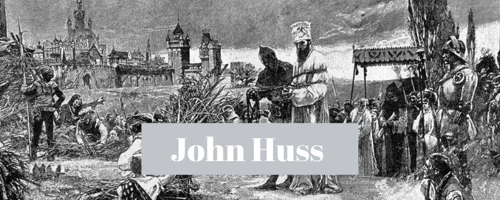
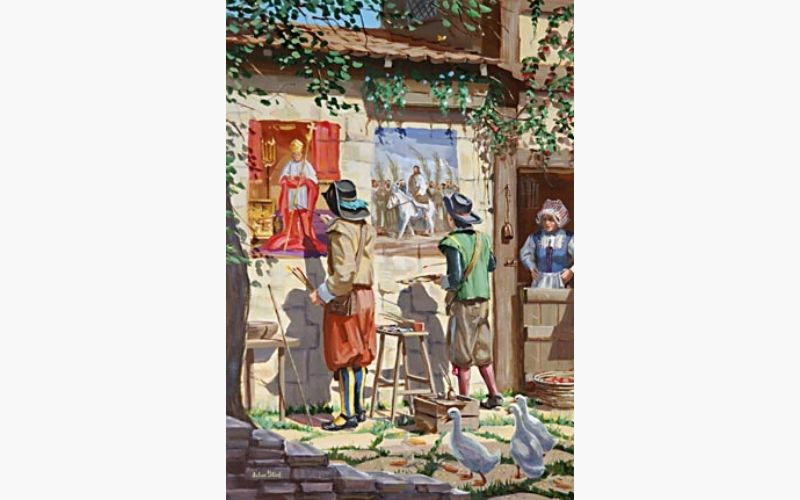

John (ou Jan) Huss foi um dos procursores mais importantes da **Reforma Protestante**. Ele não apenas foi grandemente usado na Boêmia para causar um rompimento com a igreja Católica, mas também **profetizou** sobre o ministério de Lutero.

## Do intelectualismo à fé

Em 1369, John Huss nasceu em uma pequena cidade da Boêmia (região entre o sul da Alemanha e o oeste da República Tcheca), onde ele teve uma infância muito pobre.

Apesar da sua pobreza ele era um garoto brilhante e sonhava em ser um oficial da igreja Católica, forma comum de ganhar dinheiro naquela época.

Seguindo seu sonho de um futuro financeiramente confortável, Huss entrou muito cedo, ainda adolescente, para a universidade de Praga.

É dito que, enquanto entrava na universidade pela primeira vez, sua mãe o retirou para um lugar afastado e orou por ele, para que Deus o fizesse um instrumento em suas mãos.

Talvez ela não tenha vivido para ver quão amplamente Deus responderia sua oração!

Durante seus anos de estudo Huss adquiriu dois bacharelados, em Letras e Teologia, e seu mestrado em Teologia. Com o passar do tempo passou a se tornar um dos intelectuais mais respeitados de Praga.

Durante seu tempo na universidade ele também fez um grande amigo, que é conhecido na história como *Jerônimo de Praga* e era um pregador eloquente e viria a ser um grande complemento para o seu ministério.

Certa vez, Jerônimo fez uma viagem para a Inglaterra e lá conheceu os materiais de **John Wycliffe**, que o encantaram e, com o encorajamento da Rainha da Inglaterra, decidiu trazê-los consigo para Praga.

____

[*Veja aqui nosso estudo sobre a vida de John Wycliffe, a Estrela da Manhã da Reforma*](https://examinandoasescrituras.com/historia-da-igreja/quem-foram-john-wycliffe-e-os-lollardos/).

____

Huss passou a estudar com muito desejo as obras de Wycliffe, que começaram a causar uma grande impressão no seu espírito.

Ainda nesse mesmo contexto, dois pregadores vindos da Inglaterra, ao pregarem as doutrinas reformadas de Wycliffe, foram silenciados pela igreja Católica, sendo proibidos de pregar publicamente.

Como forma de protesto, foram até o centro da cidade e fizeram duas obras de arte. Uma com a imagem do papa, em todo o luxo, ouro e glória humana. Outra, de Jesus assentado em um jumentinho:

 

Estas imagens mexeram profundamente com o coração de John Huss, que já vinha sendo despertado pelo Espírito através das obras de Wycliffe que sempre o levavam para a Palavra de Deus.

A partir desse momento ele passou a repensar sua fé e seus objetivos, o que colocou um novo rumo em seu ministério e sua vida.

## Perseguição e oposição da igreja Católica

Nesse período, ele pregava semanalmente na *Capela Betel*, em Praga. Foi do púlpito dessa pequena capela que os ensinos reformados, agora iluminados e incendiados pelo Espírito Santo, começaram a impactar o mundo.

Seu ensino se tornou tão conhecido que chegou aos ouvidos da igreja Católica em Roma e causou tanto incômodo que o chamaram para uma audiência. A proposta era que seus ensinos fossem avaliados por um juri que definiria se ele seria classificado ou não como herege, o que significaria morte certa pra ele.

Huss, sabendo do risco, não compareceu. Entretanto, a igreja Católica realizou a audiência mesmo na sua ausência, resultando em sua condenação como herege.

Nesse período, as autoridades religiosas estavam tão profundamente incomodadas que colocaram a cidade de Praga sob um "interdito", que na superstição católica significa que as portas do céu estariam fechadas para as pessoas daquela cidade.

Essa estratégia funcionou e as pessoas de Praga expulsaram John Huss para reverter o "interdito".

John Huss então se tornou um pregador itinerante, espalhando a verdade do evangelho transformador de Cristo pelas cidades da Boêmia. Quanto mais a igreja Católica tentava silencia-lo, mais seu ministério prosperava.

Depois de algum tempo, o "interdito" havia sido retirado de praga e Huss voltou para a Capela Betel, pregando com ainda mais zelo, agora direcionando sua atenção contra a venda da salvação por meio das indulgências.

Mais uma vez a igreja apelou para a superstição, declarando um novo "interdito", fazendo com que Huss saísse mais uma vez da Capela Betel. Agora para nunca mais voltar.

## Seu martírio em defesa da Verdade

Nessa época, havia uma grande confusão na igreja Católica, porque três homens diziam ser papas.

Por isso, foi organizado em 1415 o Concílio de Constança, com a finalidade de resolver a questão da autoridade na igreja Católica.

Entretanto, o principal motivo do concílio era "limpar a igreja de heresias". Foi nessa ocasião que condenaram John Wycliffe à fogueira mesmo já estando morto (queimaram, então, seus ossos). Também chamaram Huss, para prestar esclarecimentos.

Para garantir que Huss estivesse presente, a igreja Católica lhe ofereceu um Salvo Conduto (uma garantia de que ele não seria preso ou morto). Mas ao chegar em Constança ele foi capturado, algemado e lançado em uma masmorra. Haviam mentido para ele.

Depois de muitas semanas, enfraquecido e enfermo pelos sofrimentos na masmorra, foi levado a julgamento para defender-se das acusações feitas contra ele para, por fim, ser condenado.

Quando oferecido a oportunidade de renunciar seu ensino, ele disse com muita simplicidade:

> Não posso. Apelo a Jesus Cristo, o único juiz que é poderoso e totalmente justo.

Assim, o vestiram com uma roupa sacerdotal, zombaram dele e fizeram uma coroa de papel com desenhos de demônios para o coroarem. Por fim, o levaram para o local onde seria queimado.

Mais uma vez disseram "retrate-se, renuncie seus ensinos e você sairá daqui caminhando", ao que ele respondeu:

> De que erros eu me retrataria? Deus sabe que a evidência contra mim é falsa. Eu nunca pensei ou preguei, exceto com a única intenção de, se possível, ganhar os homens dos seus pecados.

Uma das autoridades católicas bradou: "John Huss, nós, agora, entregamos tua alma ao diabo", mas ele disse:

> Senhor Jesus, em tuas mão eu entrego meu espírito, porque tu me redimiste.

Um costume dos carrascos naquela época era acender o fogo por trás. Entretanto, Huss disse ao seu executor:

> Pode vir pela frente. Se estivesse com medo, não estaria aqui.

O nome **Huss** na língua Boêmia significa "ganso". Então, quando acenderam a fogueira, ele declarou:

> Hoje vocês estão queimando um ganso. Mas **em cem anos** vocês se defrontarão com um cisne, e ele vocês não poderão queimar.

Assim, em 1415, morria John Huss, queimado junto com seus livros, cantando um cântico que dizia: "Jesus, filho de Davi, tem compaixão de mim".

## O legado que nos toca ainda hoje

Quero te convidar a pensar sobre suas últimas palavras. Porque quando olhamos para a história da Igreja percebemos que, mais do que apenas um desejo no seu coração, ele estava fazendo uma declaração profética:

No ano de 1517, literalmente **cento e dois** anos após a sua morte, um homem chamado Martinho Lutero prega 95 teses contra as doutrinas da igreja Católica na porta da igreja do castelo de Witemberg.

A igreja estava se deparando com um cisne que eles não poderiam queimar.

Esse aspecto profético da morte de Huss nos mostra que, muito mais do que um agir humano, político, religioso, havia um agir de Deus. Poucos estiveram atentos e dispostos a dizer **sim** e pagar o preço. Mas Deus usou poderosamente aqueles que fizeram.

Que muitos estejam atentos ao mover de Deus em **nossos** dias. Digamos **sim** ao seu chamado e sejamos um canal de transformação. Huss nos ensina isso ainda hoje com seu exemplo.

Hoje sua estátua se levanta no mesmo lugar onde um dia ele foi queimado, nos lembrando das palavras de Jesus, que disse:

> Bem-aventurados sois quando, por minha causa, vos injuriarem, e vos perseguirem, e, mentindo, disserem todo mal contra vós.
>
> Mateus 5:11

Por: **Filipe Merker**

