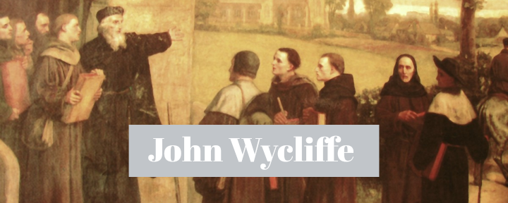

John Wycliffe é carinhosamente chamado de "Estrela da Manhã da Reforma". Ele foi responsável pela primeira tradução da Bíblia para o inglês, e uma das grandes influências para a **Reforma Protestante**.

## Amor à santidade de Deus

John Wycliffe viveu dos anos 1328 a 1364 e foi um grande intelectual, passando a maior parte da sua vida na universidade.

Entretanto, aos seus 24 anos, ele presenciou a chegada da *peste negra* na Inglaterra, onde vivia, na universidade de Oxford.

A peste não tinha cura e ceifou centenas de milhares de vidas. Esse passou a ser o dia a dia de um cidadão europeu, lidando com a morte diariamente.

Alguns autores acreditam que a convivência com a morte tão de perto tenha gerado um profundo temor no coração de Wycliffe: não da morte, mas de Deus.

O temor de Deus, aliado ao seu amor as Escrituras fizeram dele um homem que não temia a homem algum. A **verdade** era sua máxima prioridade.

Mais tarde, em 1360, já em uma posição de autoridade dentro da igreja Católica, Wycliffe começou a perceber a podridão da religião institucionalizada e passou a escreveu artigos contra a imoralidade. Esse período é chamado por alguns historiadores de "a ação da poderosa caneta de Wycliffe".

Ele escreveu contra a imoralidade de frades que se envolviam em orgias e glutonarias. Escreveu contra doutrinas anti-bíblicas como a *transubstanciação* e as *indulgências*.

Em 1383, na cidade de Oxford, Wycliffe foi chamado para prestar esclarecimentos sobre seus escritos contra a Igreja. Armaram contra ele um juri formado pelos maiores intelectuais da universidade, com o objetivo de encontrarem heresias naquilo que ele falasse. Wycliffe começou então seu discurso diante do juri.

Quando terminou, seus inquisidores não apenas não tinham perguntas, mas permaneceram em silêncio, sem terem o que dizer. Wycliffe guardou seus esboços e saiu da sala com todos ainda em silêncio.

## Amor à verdade da Palavra de Deus

Em 1378, Wycliffe iniciou com seu grupo de discípulos, chamados de Lollardos, a tradução da Bíblia para o Inglês.

Ele cria que a Bíblia deveria ser o instrumento para julgar tudo, inclusive a Igreja, à luz da vontade e autoridade de Deus. Wycliffe também cria que era indispensável que **todas as pessoas** tivessem acesso à Bíblia em sua língua.

Em 1380, essa obra foi concluída! **A Bíblia estava disponível na língua do povo**.

Entretanto, era um trabalho árduo e perigoso negociar com os copistas para que novos exemplares da Bíblia fossem produzidos. Eles muitas vezes fizeram armadilhas contra Wycliffe para entregá-lo à igreja que o queria matar.

Também, nesse período, todas as obras escritas precisavam ser copiadas a mão. Assim, cada nova cópia da sua Bíblia levava 10 meses para ficar pronta. E o custo de um desses exemplares era o equivalente a 2400 porcos ou 4800 galinhas.

Mas podemos perceber que o Espírito Santo estava trabalhando no coração das pessoas, gerando fome da palavra de Deus.

O historiador John Foxe diz que muitas pessoas trocavam o salário de um dia inteiro de trabalho por uma página da Bíblia. Outras, trocavam o salário de alguns dias pelo aluguel da Bíblia por um dia.

## A influência de John Wycliffe e dos Lollardos

É impossível medir com exatidão a influência desse homem, mas é inegável que ele foi um instrumento de Deus para libertar a igreja em um período de trevas e colocar o pavimento para que a Reforma Protestante acontecesse. 

Sua tradução da Bíblia impacta o mundo até hoje, tendo sido base para outras traduções como a Bíblia Tyndale e a Bíblia King James.

Felizmente, Wycliffe pôde terminar a sua vida tranquilamente, como pastor de uma paróquia do interior da Inglaterra, de onde duas pregações ainda impactaram o mundo.

Entretanto, seus discípulos tiveram um fim diferente. Foram brutalmente perseguidos e muitos foram queimados e torturados por amor ao Senhor e a Sua Palavra.

No ano de 1415, o Concílio de Constança determinou que os livros e os ossos de Wycliffe fossem queimados e suas cinzas atiradas no rio Severn, que desaguava em sua cidade. Sobre isso, Thomas Fuller escreveu:

> Desse modo, este pequeno arroio levou suas cinzas até Avon, de Avon até Severn, de Severn até os estreitos mares e destes até o mar aberto. E assim, as cinzas de Wycliffe **são o símbolo de suas doutrinas**, que agora estão dispersas pelo mundo inteiro.

Como [Pedro Valdo](/historia-da-igreja/quem-foram-pedro-valdo-e-os-valdenses/), Wycliffe também tem sua estátua na cidade de Worms, em um monumento à Reforma Protestante, como sendo um dos fundamentos de Lutero.

Sua estátua está lá para nos lembrar que, em tempos de trevas, Deus encontrou homens que ousaram responder ao seu chamado para serem luz.

Mas, ainda mais importante que sua estátua, é o fato de que seu nome está escrito nos céus, e que hoje ele está com o Senhor Jesus, pelo qual ele viveu e morreu.

Por: **Filipe Merker**

