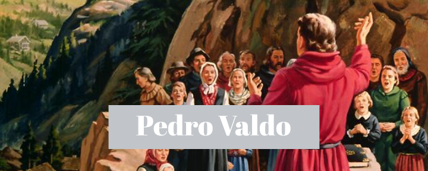
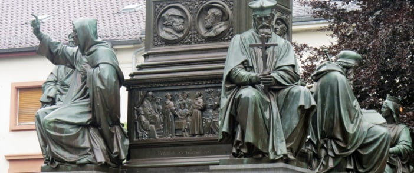

Pedro Valdo foi uma figura importante e inspiradora na história da Igreja Cristã. Foi o líder dos Valdenses e um dos precursores da **Reforma Protestante**.

## Desapego ao dinheiro

Não há muito escrito sobre sua vida, mas as evidências sugerem que ele era um rico comerciante da região de Lyon, na França.

Profundamente incomodado com a **religiosidade e idolatria da igreja Católica Romana** na sua época, decidiu viver um cristianismo radical, baseado no pouco que havia aprendido sobre Jesus.

Faminto pela Palavra de Deus, vendeu seus bens com duas finalidades: aliviar o sofrimento dos necessitados e pagar um clérigo para que **traduzisse a Bíblia** para sua lingua, o Franco-Provençal.

Durante uma festa da igreja Católica, enquanto jogava seu dinheiro aos pobres, ele bradou:

>  "Nenhum homem pode servir a dois senhores, Deus e Mamon." (Mt 6:24)

Ao ver isso, muitos dos seus amigos o tiveram por louco e fugiram. Mas indo a um lugar mais alto, disse:

> "Meus compatriotas e amigos, não estou louco como pensam, mas estou me vingando de meus inimigos, que me fizeram escravo, pois sempre tive mais cuidado com dinheiro do que com Deus, e servi a criatura no lugar do Criador. 
>
> Sei que muitos me acusarão por agir abertamente, mas eu o faço por minha própria conta e por vós; na minha conta, pois quem me ver de agora em diante possuindo algum dinheiro irá dizer que estou louco, e por vós, de modo que aprendam a colocar esperança em Deus e não nos ricos."

## Amor à Palavra de Deus

À medida que foi conhecendo mais a Palavra de Deus, que havia mandado traduzir, passou a ser visto nas ruas pregando porções memorizadas da Bíblia.

**Pedro Valdo foi um dos precursores modernos da pregação ao ar livre.** Uma prática muito comum para Jesus, seus discípulos e a Igreja Primitiva.

Os princípios que ele ensinou a seus discípulos nunca foram muito mais complexos que uma vida simples e o amor à Palavra de Deus, que ele encorajavam que memorizassem.

Em 1179, Pedro Valdo e seus discípulos foram à Roma para procurarem aprovação da igreja Católica na tentativa de se tornarem um movimento oficial. Mas o Papa Alexandre III não considerou seu pedido, permitindo que ele pregasse apenas onde os bispos permitissem (o que, na prática, seria lugar nenhum).

Valdo, ao retornar a Lyon, afirmou: "Mais importa obedecer a Deus do que aos homens." (Atos 5:29)

Mesmo com a proibição, Pedro Valdo e seus seguidores continuaram vivendo e pregando o evangelho, o que os levou a serem excomungados da Igreja Católica em 1184 pelo Papa Lúcio III.

Após esse período, não satisfeito com a excomunhão, um papa chamado Inocêncio III criou o famoso tribunal da inquisição, com o expresso objetivo de perseguir os Valdenses. O grupo irônicamente conhecido como "Os Pobres de Espírito" agora passa a ser violentamente perseguido.

A Bíblia que os Valdenses tanto amavam, por muitas vezes, durante invasões da igreja Católica em Lyon, tinha seus poucos exemplares queimados.

Nesse período, foi muito enfatizado por Pedro Valdo a prática da memorização da Bíblia, para que ela pudesse ser reescrita após as invasões e perseguições.

## A influência dos Valdenses na Europa

Após esse evento da excomunhão, percebe-se na história o surgimento de um grupo nos vales de Piedmont e Luberom, chamados de **Albigenses** que muito provavelmente já era uma expansão do grupo de discípulos de Pedro Valdo.

Entretanto, em 1209, Inocêncio III inicia um ataque chamado "cruzada albigense", uma perseguição violentíssima por toda a França, onde **a fé simples defendida por Pedro Valdo passou a ser atacada como um inimigo mortal**.

Mas em um tempo como esse, podemos ver o mesmo padrão do agir de Deus na Bíblia:

> "Naquele dia, levasntou-se **grande perseguição** contra a igreja em Jerusalém [...] os que foram dispersos, **iam por toda parte pregando a palavra**." (Atos 8:1 e 4)

Assim como nessa perseguição na igreja primitiva, em Jerusalém, também aconteceu com os Valdenses na França.

Muitos morreram pelo evangelho. Mas quando mais eram perseguidos, mais se espalharam pela Europa, de forma que é impossível medir o tamanho da sua influência e impacto na preparação de Deus para a Reforma.

Muitos autores tem identificado elementos do ensino e especialmente do exemplo de Pedro Valdo por toda a reforma.

Seja como for, hoje, em um grande monumento à Reforma na cidade de alemã de Worms, está a estátua de Pedro Valdo, como sendo **um fundamento para Lutero**.

Essa estátua está lá, para nos lembrar de um homem que **decidiu pagar o preço para viver a simplicidade de Jesus e um amor intenso à Palavra de Deus**.

Por: **Filipe Merker**