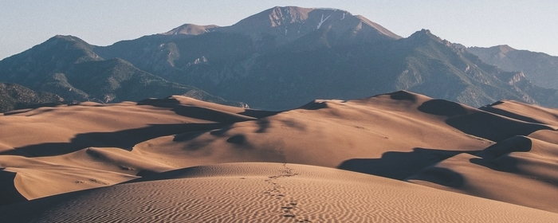

>  apareceu João Batista **no deserto**, pregando batismo de arrependimento para remissão de pecados. Saíam a ter com ele toda a província da Judéia e todos os habitantes de Jerusalém; e, confessando os seus pecados, eram batizados por ele no rio Jordão. *(Marcos 1:4)*
>
>  passou Jesus a dizer ao povo a respeito de João: **Que saístes a ver no deserto**? *(Mateus 11:7)*
>
>  **O deserto é uma necessidade**. Ele é parte do caminho estabelecido por Deus para entrarmos na terra prometida. *(Stephen Kaung)*

---

Este texto é parte de uma série sobre João Batista

1. [João Batista - Preparando o caminho do Senhor](/personagens-biblicos/joao-batista-preparando-o-caminho-do-senhor/)
2. [João Batista - Conhecendo a Deus nos desertos](/personagens-biblicos/joao-batista-conhecendo-a-deus-nos-desertos/)
3. [João Batista - Uma pregação centrada em Cristo](/personagens-biblicos/joao-batista-uma-pregacao-centrada-em-cristo/)

---

Vimos no último texto que João Batista era uma voz no deserto. Entretanto, quando estudamos a sua vida, percebemos que o deserto é  muito mais do que apenas uma informação da geografia. O deserto é um princípio espiritual que Deus usa para trabalhar a vida de um servo. Quando um homem ou uma mulher estão dispostos a serem usados pelo Senhor, podemos ter certeza que será um caminho em meio a desertos.

## A preparação do seu ministério

Antes mesmo que João desse início ao seu ministério profético, havia uma expectativa em torno dele. Preste atenção nas palavras do anjo que aparece a Zacarias, seu pai:

> Ele será grande diante do Senhor, não beberá vinho nem bebida forte e será cheio do Espírito Santo, já do ventre materno.
>
> E converterá muitos dos filhos de Israel ao Senhor, seu Deus.
>
> E irá adiante do Senhor no espírito e poder de Elias, para converter o coração dos pais aos filhos, converter os desobedientes à prudência dos justos e habilitar para o Senhor um povo preparado.
>
> *Lucas 1:15-17*

Você consegue se imaginar crescendo com promessas como essas sobre sua vida? Toda a expectativa que havia sobre ele e sua própria expectativa sobre si mesmo? Deus estava preparando um vaso que impactaria sua geração. Se também queremos ser usados para impactar a nossa geração, precisamos perceber que existe um trabalhar de Deus na vida de João.

O texto acima diz que ele seria **grande diante do Senhor**.

Nosso conceito de grandeza é muito influenciado pelo mundo. Olhamos para um homem e medimos a sua grandeza pelo que podemos ver. Mas o que faz um homem ser grande diante do Senhor? Ao olharmos para o exemplo de grandes homens de Deus ao longo da Bíblia, percebemos que um grande homem para Deus é um homem disposto a diminuir. Alguém disposto a ser nada para que Deus seja tudo. Esse é um princípio que parece estar de ponta-cabeça para o mundo. Como pode alguém que deseja ser grande, decidir ser pequeno?

Vemos um conflito semelhante a esse acontecendo com Paulo em 2 Coríntios 12. Por causa de uma grande luta, ele pede livramento ao Senhor. Qual a resposta de Deus? "A minha graça te basta, porque o poder se aperfeiçoa na fraqueza".

Esse é um conceito inaceitável para o mundo. Mas para Paulo essa foi a chave do seu ministério: "De boa vontade, pois, mais me gloriarei nas fraquezas, para que sobre mim repouse o poder de Cristo". Se somos fortes, nosso ministério sempre será limitado. Mas se somos fracos, dependemos apenas do poder de Cristo.

Se você frequentar uma academia de musculação, logo vai descobrir qual o limite das suas forças, qual o ponto a partir do qual você é incapaz de ir. Mas qual o limite do poder de Cristo? Essa é uma escolha que você deve fazer. Qual será o motor do seu ministério? Você e a sua força ou Cristo e o Seu poder?

É importante deixar claro: ser fraco não significa ser negligente ou descuidado. Cair em pecado não tem nada a ver com a fraqueza que estamos falando. Pelo contrário: justamente aqueles que confiam na sua força nunca poderão vencer o pecado. Quem pode vencer as paixões da carne se não aquele que reconhece sua fraqueza e confia no poder de Deus?

> Quem a si mesmo se exaltar será humilhado; e quem a si mesmo se humilhar será exaltado. *Mateus 23:12*
>
> Humilhai-vos na presença do Senhor, e ele vos exaltará. *Tiago 4:10*
>
> Humilhai-vos, portanto, sob a poderosa mão de Deus, para que ele, em tempo oportuno, vos exalte. *1 Pedro 5:6*

Esse é o caminho de um grande homem aos olhos do Senhor. Tantas vezes queremos reconhecimento público pelo que fazemos, queremos inverter a ordem das coisas. Mas a ordem no caminho de Deus é sempre a mesma: sem cruz, não há coroa. Sem humilhação, não há glória. Sem fraqueza, não há poder. Esse foi o caminho do João Batista.

## Conhecendo a Deus nos desertos

> O menino crescia e se fortalecia em espírito. E **viveu nos desertos** até ao dia em que havia de manifestar-se a Israel. *(Lucas 1:80)*

O que é um deserto na Bíblia? Um deserto é muito mais do que apenas uma informação da geografia, ele é um princípio do trabalhar de Deus em nós.

Quando Deus deseja moldar o caráter de um servo, ele frequentemente o manda para o deserto. O deserto é um lugar de escassez. Um lugar de falta de recursos. Ele é um simbolo da nossa fraqueza e da nossa dependência. Talvez uma das experiências de deserto mais famosas nas escrituras está registrada nos primeiros livros da Bíblia: a peregrinação de Israel durante quarenta anos. Podemos pensar em muitos significados para aqueles quarenta anos, mas o que Deus diz sobre isso?

> Recordar-te-ás de todo o caminho pelo qual o SENHOR, teu Deus, **te guiou no deserto** estes quarenta anos, **para te humilhar, para te provar, para saber o que estava no teu coração**, se guardarias ou não os seus mandamentos.
>
> Ele te humilhou, e te deixou ter fome, e te sustentou com o maná, que tu não conhecias, nem teus pais o conheciam, para te dar a entender que não só de pão viverá o homem, mas de tudo o que procede da boca do SENHOR viverá o homem.
>
> Nunca envelheceu a tua veste sobre ti, nem se inchou o teu pé nestes quarenta anos.
>
> Sabe, pois, no teu coração, que, como um homem disciplina a seu filho, assim te disciplina o SENHOR, teu Deus. (Deuteronômio 8:2-5)

É isso! O deserto é um lugar onde Deus é nossa única fonte. Mesmo em meio às necessidades, aprendemos que ele é nosso provedor fiel. Vamos descobrir que mesmo que não tenhamos o que comer, Deus nos sustenta com o maná. O que é o maná? É a provisão sobrenatural de Deus. É a força em meio à fraqueza. Mesmo que não tenhamos roupas novas para vestir, nossas roupas não envelhecerão. Essa é a provisão que só poderemos receber no deserto.

O texto diz que "como um homem disciplina a seu filho, assim te disciplina o SENHOR, teu Deus". Muitos olham para esse versículo e só conseguem ver a disciplina. Quero convidar você para ver a paternidade de Deus. Em meio às lutas que temos no dia a dia, quero te convidar a ver que há um Deus, acima dos problemas, que é o nosso Pai. Que lugar melhor para conhecer o amor de Deus? Ah, que Deus nos leve para o deserto!

Esse foi o lugar onde Deus escondeu e trabalhou João Batista até o momento em que ele começaria o seu ministério.

> **veio a palavra** de Deus a João, filho de Zacarias, **no deserto**. *Lucas 3:2*

Quando lemos que "veio a palavra" a João, o que isso quer dizer? Estudando, você vai descobrir que essa é uma expressão que marca o início de um ministério profético:

> **veio a palavra** do SENHOR a Abrão (*Gn 15:1*)
>
> **veio a palavra** do SENHOR a Elias (*1 Reis 18:1*)
>
> **veio a palavra** do SENHOR a Semaías (*2 Crônicas 11:2*)
>
> a ele [Jeremias] **veio a palavra** do SENHOR (*Jeremias 1:2*)
>
> **veio** **expressamente** **a palavra** do SENHOR a Ezequiel (*Ezequiel 1:3*)
>
> **Veio a palavra** do SENHOR a Jonas (*Jonas 1:1*)

Segundo a prática do Antigo Testamento, um profeta não precisaria ser ungido ou autorizado por outra pessoa para atuar como profeta. O que ele precisava era de uma capacitação do Espírito Santo, ou seja, ser ungido pelo próprio Deus. Portanto, dizer que "veio a palavra", significa dizer que o Espírito estava capacitando aquela pessoa para profetizar.

Esse é o início do ministério da João Batista. A palavra veio a ele. Ele estava pronto. Mas onde ele estava? No deserto!

Lá o seu caráter havia sido trabalhado. Quando ele disse que a finalidade do seu ministério era "que eu diminua", onde vocês acham que ele aprendeu que deveria diminuir? No deserto.

Para João Batista, o seu deserto foi literal, ele viveu no deserto da Judéia. Mas lembre-se, o deserto é um princípio espiritual. Quando você olha a formação do caráter de um homem ou uma mulher de Deus, os desertos estarão lá nas mais diferentes formas! Paulo passou pelos seus desertos, Pedro teve os seus próprios, João foi trabalhando no mesmo terreno. Como disse Stephen Kaung: **O deserto é uma necessidade**. Ele é parte do caminho estabelecido por Deus para entrarmos na terra prometida.

Para aqueles que estiverem atravessando os seus desertos, lembrem: Jesus passou pelo deserto. Na verdade, em Mateus 4:1 vemos que foi o Espírito Santo que o conduziu para o deserto. Qual a finalidade disso? Você pode estudar cuidadosamente e perceberá: os 40 dias de Jesus no deserto são um contraste aos 40 anos de Israel no deserto: qual a diferença? Jesus saiu de lá vitorioso. Ele foi aprovado em todas as tentações.

Mas e nós? Quantas vezes reclamamos. Pensamos: que tipo de Deus me colocaria em uma situação como essa? Quando o trabalho vai mal, ou o relacionamento com Deus parece que não vai para frente, não conseguimos orar ou ler a Bíblia. Talvez tenhamos conflitos no relacionamento com nossos irmãos na igreja. Talvez tudo isso junto. Talvez por muitos anos.

Por que tantos desertos? A resposta é: Porque Deus não desiste de você. Ele está comprometido a formar o teu caráter e ele vai fazer uma obra completa.

Mas qual então o caminho de saída do deserto? Podemos encontrar a resposta nas palavras de João Batista: Convém que Ele cresça e eu diminua. João disse sobre Jesus: após mim, vem alguém que é **mais poderoso do que eu**. Onde ele conheceu o poder de Cristo? Na fraqueza. Essa é uma descoberta que nós precisamos fazer individualmente. Esse é o caminho de saída do deserto: quando essa realidade vai se tornando uma revelação e uma decisão pessoal para nós. Eu decido diminuir! Eu decido depender! Eu decido confiar!

##O resultado dos desertos em nossa vida

> Então, em partindo eles, passou Jesus a dizer ao povo a respeito de João: Que saístes a ver no deserto? Um caniço agitado pelo vento? Sim, que saístes a ver? Um homem vestido de roupas finas? Ora, os que vestem roupas finas assistem nos palácios reais. Mas para que saístes? Para ver um profeta? Sim, eu vos digo, e muito mais que profeta.

Quem foi João Batista? **João não era um caniço agitado pelo vento**. Jesus disse que os ventos e as águas são como os problemas que sopram contra uma casa, mas João não era agitado pelos problemas. Quantas vezes somos instáveis, levados de um lado para o outro por todo vento de doutrina? A finalidade de Deus com o deserto é nos levar a um nível de intimidade e confiança mais profundos. Deus quer que sejamos inabaláveis. Segundo o mundo, um homem inabalável é um homem forte. Para Deus, um homem inabalável é um homem fraco, que depende de um Deus infinitamente poderoso. Esse homem é capaz de olhar para as maiores dificuldades da vida com a confiança de um gigante. Benditas sejam as crises em nossa vida, onde, quando somos fracos, somos fortes. João não era um caniço agitado pelo vento.

**João não era um homem vestido de roupas finas**. Jesus nos ensina que o lugar dos amantes do prazer e da boa vida não é no deserto. Eles estão nos palácios desse mundo. Nos lugares confortáveis e seguros. Quantos filhos de Deus não se encontram hoje trancados nos palácios do prazer e da autoconfiança? Mas por sua infinita misericórdia Deus nos leva para o deserto, onde as roupas finas da vaidade e os palácios não tem lugar. Lá ele nos ensina que nem só de pão viverá o homem. Mesmo que nos falte o pão, ele nos alimenta com o maná. Mesmo que nos falte roupa, nossas roupas não envelhecerão. Quanto amor! Quanta misericórdia! Lá descobrimos que Deus é o nosso provedor e Ele é tudo que precisamos. João não era um homem vestido de roupas finas.

Quem então era João? Um profeta. Muito mais que um profeta: um grande homem aos olhos de Deus.

Esse é um chamado para os nossos dias! Que como povo de Deus, possamos aprender que o deserto é uma necessidade. Possamos nos deixar trabalhar em meio às lutas e necessidades. Mais de Ti Jesus e menos de nós, é o que queremos e sabemos que o deserto é o lugar onde vais nos ensinar essa vardade tão rica.

Esse é o único caminho para aqueles de nós que desejam um verdadeiro ministério. Mais do que isso: esse é o único caminho para crescermos diante do Senhor.